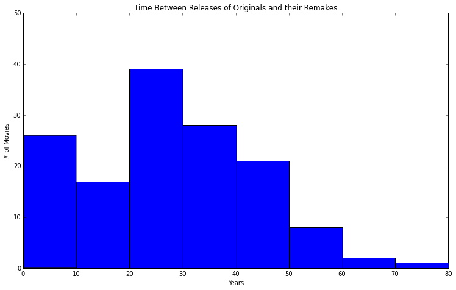
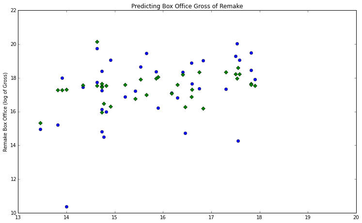

<h1> Luther Minimum Viable Product Check-in <h1>
===========

<h4> Movie remakes are most commonly released 20 to 30 years after the original </h4>
 

<h4> Model predicts the box office gross using regression with the following factors: </h4>

*Box Office Gross of the Original Movie

*(Years Between Releases)^n (n<8)

<h3> The plot shows the observed vs. model-predicted outcomes on a test set

